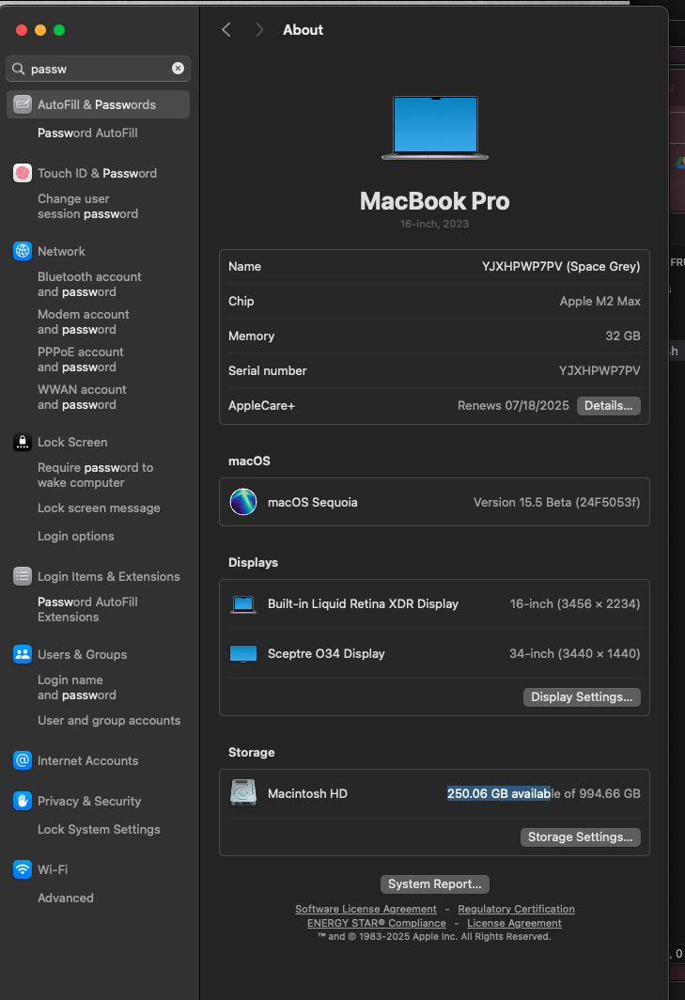

I seriously don't think they have root accesss, but according to ChatGPT, the disk was fine, the power was fine, everything was fine except using QuickTime, like Colab, or ChatGPT sometimes, etc. but quicktime.. you could advanced data encryption all you want but.. the DA could before I delete it.

QuickTime’s MOV/MP4 container is built around a hierarchy of “atoms” (also called “boxes”), two of which are indispensable:
	•	mdat (media data atom): contains the raw encoded audio/video samples.
	•	moov (movie atom): contains all of the indexing and metadata (track tables, sample tables, timing, codec parameters, etc.) that tell a player how to interpret the mdat payload.

When QuickTime Player (or any AVFoundation-based recorder) creates a new recording, it typically:
	1.	Opens an AVAssetWriter for the desired output URL.
	2.	Starts writing incoming sample buffers—often breaking them into moof (movie fragment) atoms at regular intervals (controlled by movieFragmentInterval) to allow partial playback or streaming.
	3.	Continues appending media to the file’s mdat area until you hit Stop.
	4.	On a successful call to finishWriting, consolidates all the fragments (the moof boxes) into a single, final moov atom (and writes it, usually at the end of the file unless shouldOptimizeForNetworkUse is enabled) so that the file becomes a self‑contained, standard MOV/M4A/M4V movie.   

⸻

Why a built‑in QuickTime recording might lack a valid moov
Because the moov atom—and any final cleanup of fragmented metadata—is only written when the recording session completes cleanly, any interruption before finishWriting will leave you with a file that has data (mdat) but no usable index (moov). Common culprits include:
	•	Crashing or force‑quitting QuickTime Player
	•	Power loss or system crash during recording
	•	Running out of disk space or hitting quota limits
	•	File system errors or permission issues when finalizing
	•	Calling cancelWriting or otherwise aborting the AVAssetWriter session

In all these cases, the AVAssetWriter never gets to consolidate fragments into the moov atom, and you’ll see “moov atom not found” errors.   # the-fruit-investigations
 

-------

Yes – when you record with QuickTime Player (or any AVFoundation-based recorder), the app immediately writes your incoming video/audio into a hidden “autosave” file (and into the system temporary directory) before you ever choose where to save. Only when you hit Save… (which calls finishWriting internally) does QuickTime package that data into a normal .mov at your chosen path.
	•	Autosave Package
QuickTime Player uses macOS’s AutoSave infrastructure to keep your recording safe. As soon as you start, it creates a package at:

~/Library/Containers/com.apple.QuickTimePlayerX/
  Data/Library/Autosave Information/
    Unsaved QuickTime Player Document.qtxcomposition

You can right‑click that .qtxcomposition file, choose Show Package Contents, and inside you’ll find the actual .mov fragments.  

	•	Temporary Items
Simultaneously, data is also buffered into your per‑session temp folder. In Terminal, run:

open "$TMPDIR"

Then look under TemporaryItems (often in a subfolder named com.apple.QuickTimePlayerX) for .mov chunks. These persist until the system purges old temp files.  

If the app or system crashes, or you cancel/force‑quit before the Save dialog completes, those hidden files remain (until macOS cleans them up), and you can recover your recording by retrieving and renaming the .mov inside the autosave package or temp folder.